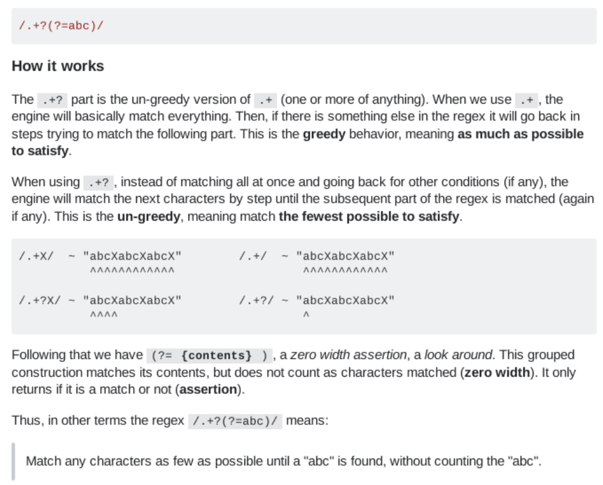
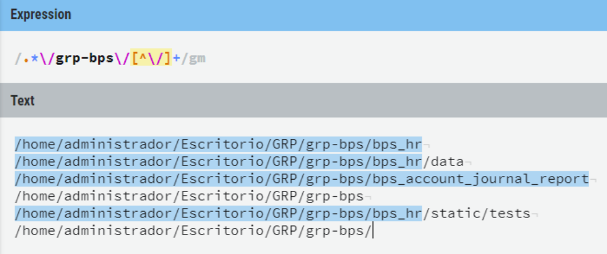

regexp
======
**http**

    https.+?(?=")
    
The .+? part is the un-greedy version of .+ (one or more of anything). When we use .+, the engine will basically match everything. Then, if there is something else in the regex it will go back in steps trying to match the following part. This is the greedy behavior, meaning as much as possible to satisfy.

When using .+?, instead of matching all at once and going back for other conditions (if any), the engine will match the next characters by step until the subsequent part of the regex is matched (again if any). This is the un-greedy, meaning match the fewest possible to satisfy.

/.+X/  ~ "abcXabcXabcX"        /.+/  ~ "abcXabcXabcX"
          ^^^^^^^^^^^^                  ^^^^^^^^^^^^

/.+?X/ ~ "abcXabcXabcX"        /.+?/ ~ "abcXabcXabcX"
          ^^^^                          ^
    
 

    .*\/grp-bps\/[^\/]+

